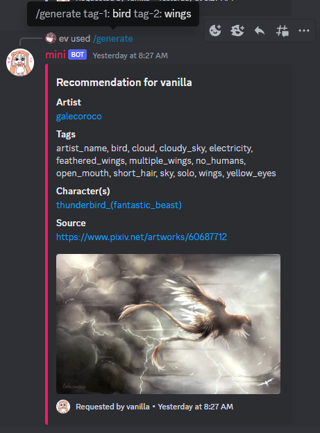
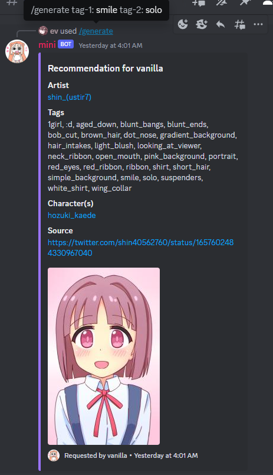

	
	<h1 align="center">Mini</h1>

A booru-based pseudo-random image generator discord bot

## Example

    
Using generate command 

    
    

## Features
Whilst the main feature is `Generate` which suggests a random picture, there are other features available:
- Image:
	- Generate
	- Tags
- Manage chat:
	- Clear All
	- Clear
- Misc:
	- Carrot
	- Help

## Acknowledgements
Artwork by 